Couple of projects I’ve worked on my own or in collaboration, either on personal projects or game jams. Some of them where released at some point on iOS and Android ( but are no longer available for download ), other are still available for download on [mikea15.itch.io](https://mikea15.itch.io/)

# Astromike

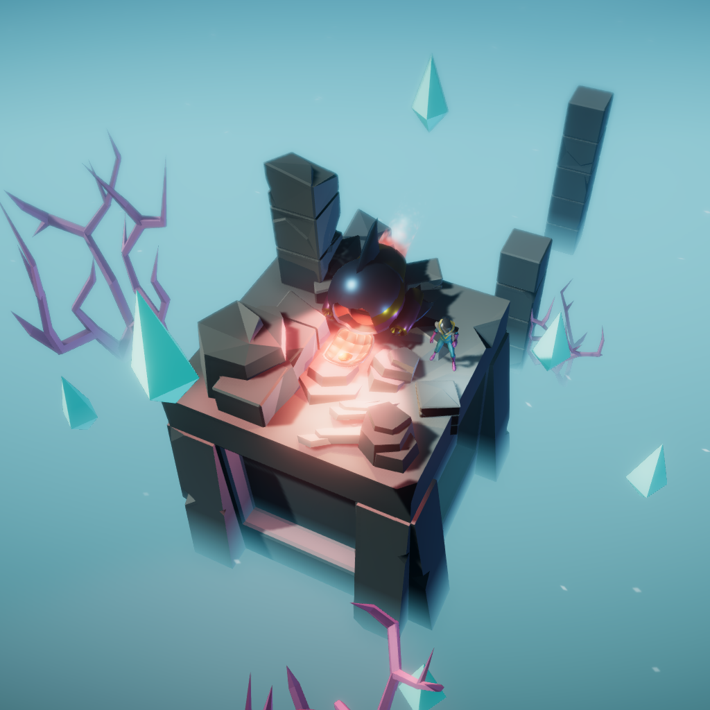
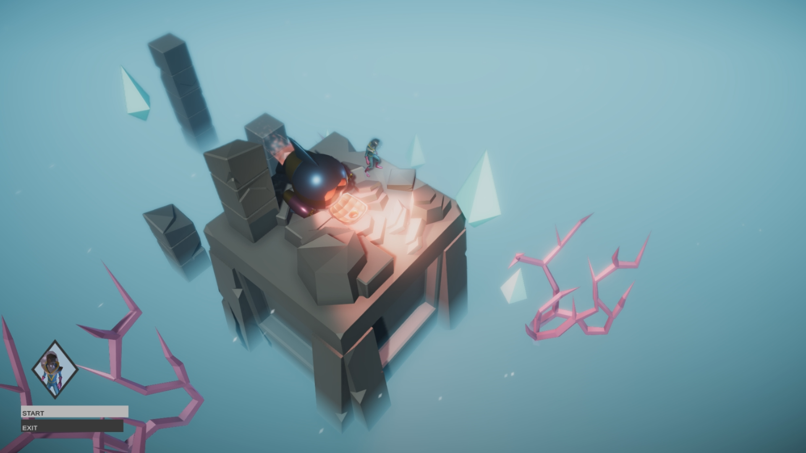
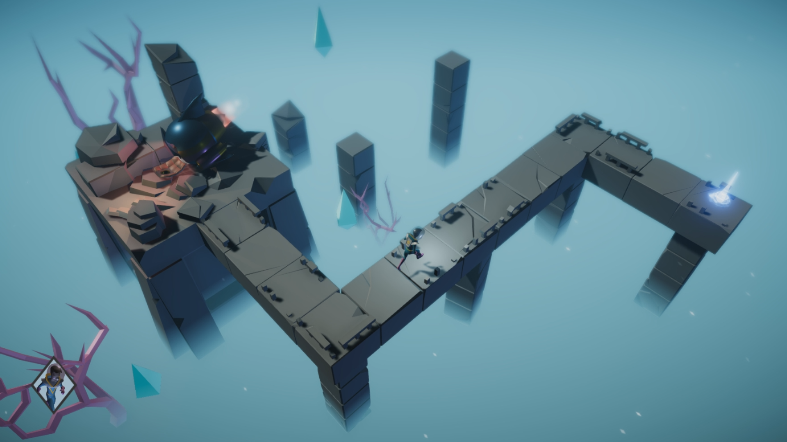
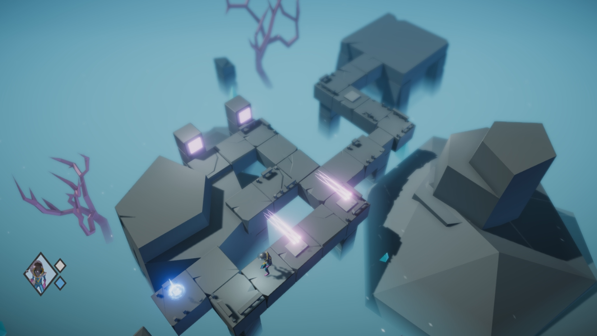
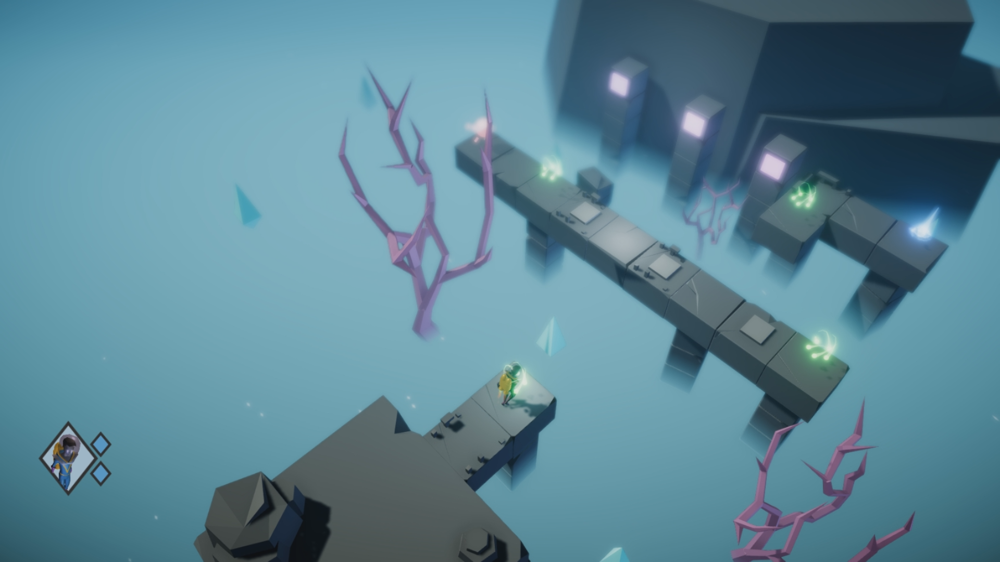

Made under 72h for [Ludum Dare 38](https://ldjam.com/events/ludum-dare/38/astromike) with [Marco Vale](https://twitter.com/MarcoValeKaz) on 3D. Inspired by Monument Valley and Lara Croft GO.

<iframe width="560" height="315" src="https://www.youtube.com/embed/b30id6bcWQk" frameborder="0" allow="accelerometer; autoplay; clipboard-write; encrypted-media; gyroscope; picture-in-picture" allowfullscreen></iframe>

\> *[Download on itch.io](https://mikea15.itch.io/astromike)*

# SuperStems

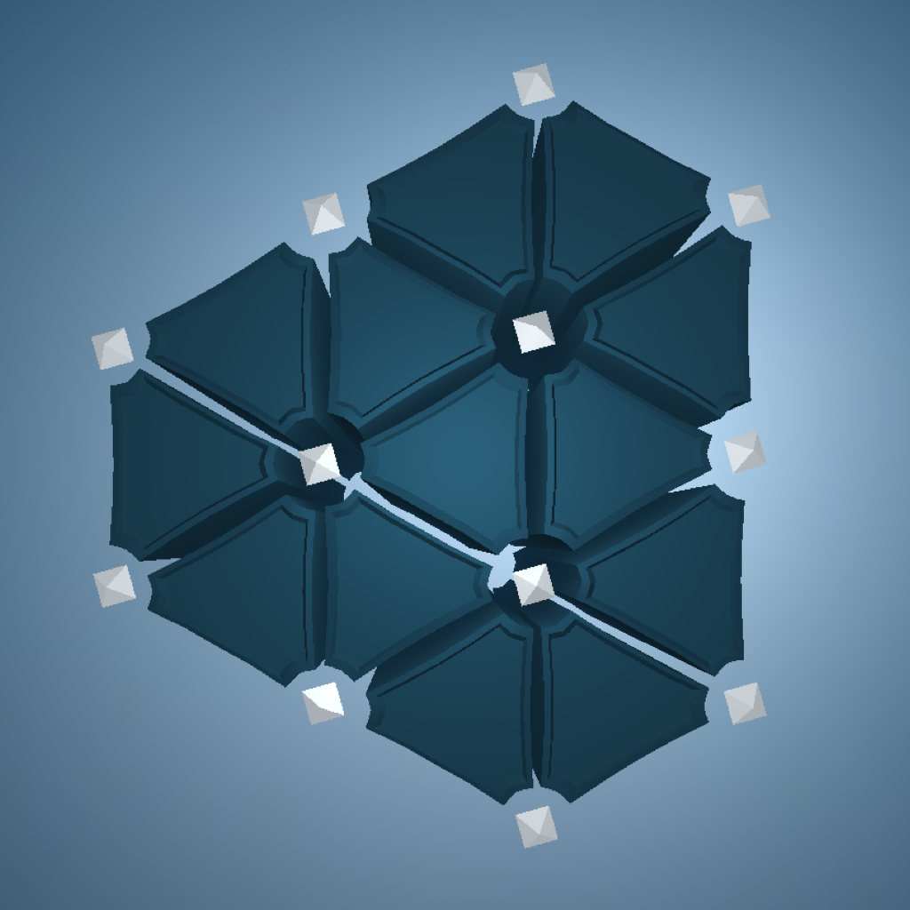
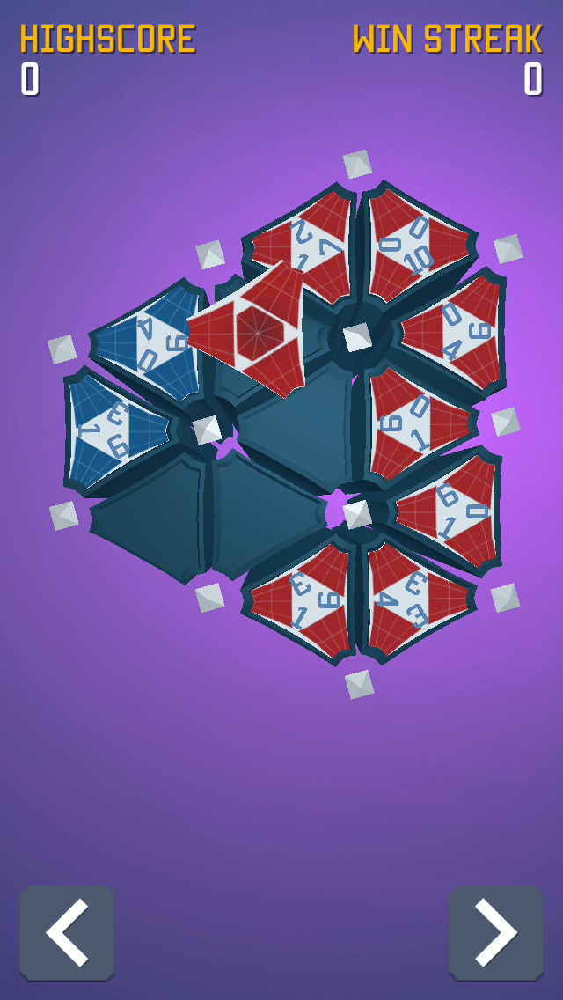
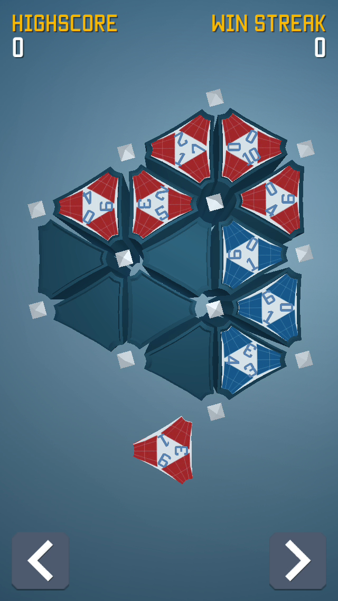
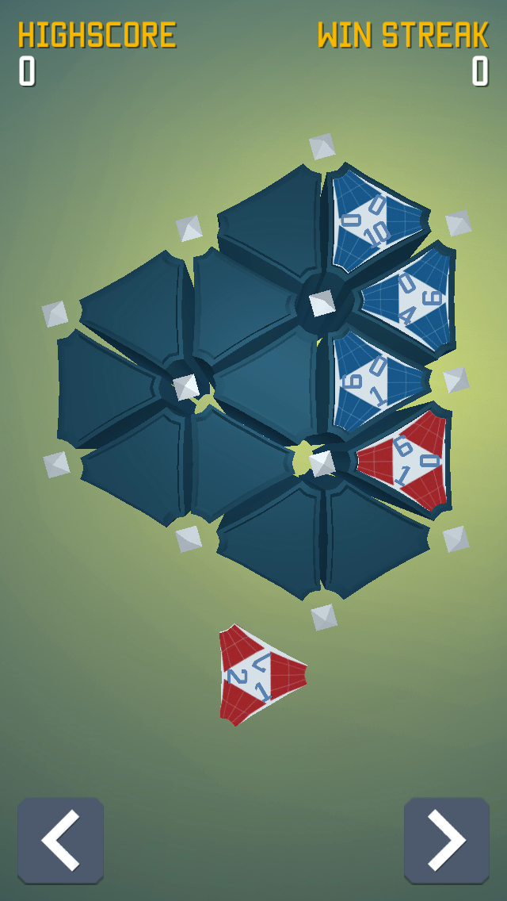
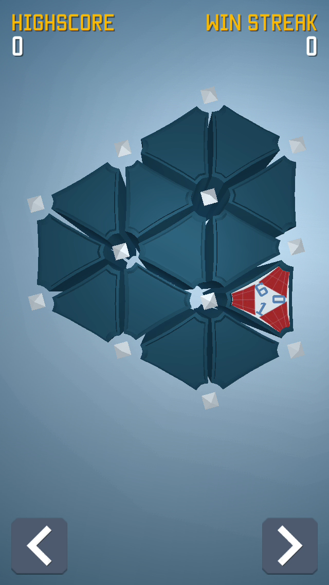
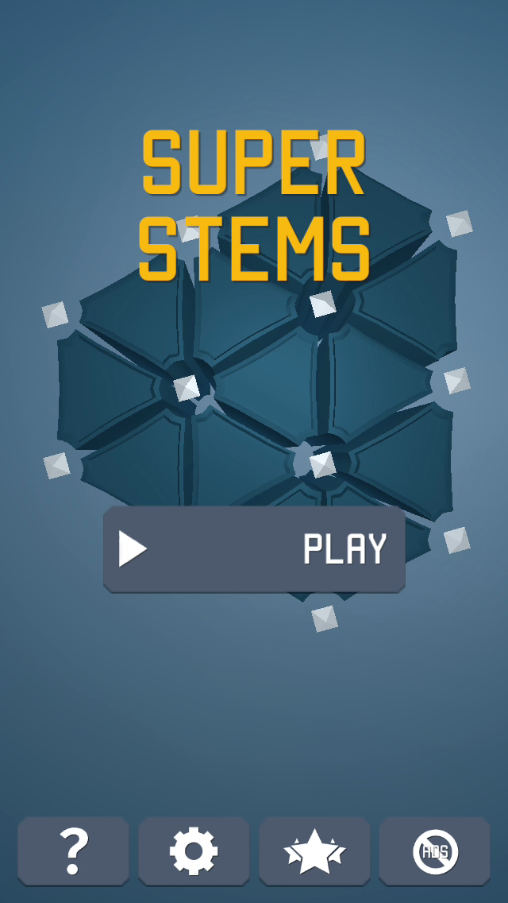

SuperStems was made under 48h for Ludum Dare 31. I continued to work on it for a while to release it for iOS. Super Stems is a board strategy dominion game where you place tiles to dominate the board. No longer available on the AppStore.

# Jumpy Rope

Jumpy Rope is a casual jump the rope game I released for iOS and Android. Jump the rope as much as you can and unlock new clothes, power ups, and floating islands! No longer available on the AppStore.

- 3D Art by [FiSilvia](https://twitter.com/fifsilva)
- Sound degisn by [Joao Costa](https://twitter.com/dainomyte)
- Animation by [Guilherme Martins](https://www.artstation.com/artist/guinimation)

# Memtile Kids

Memtiles Kids is a memory matching game for kids with 4 different themes to unlock and over 100 levels. It was released on Android and iOS. No longer available on the AppStore. 

