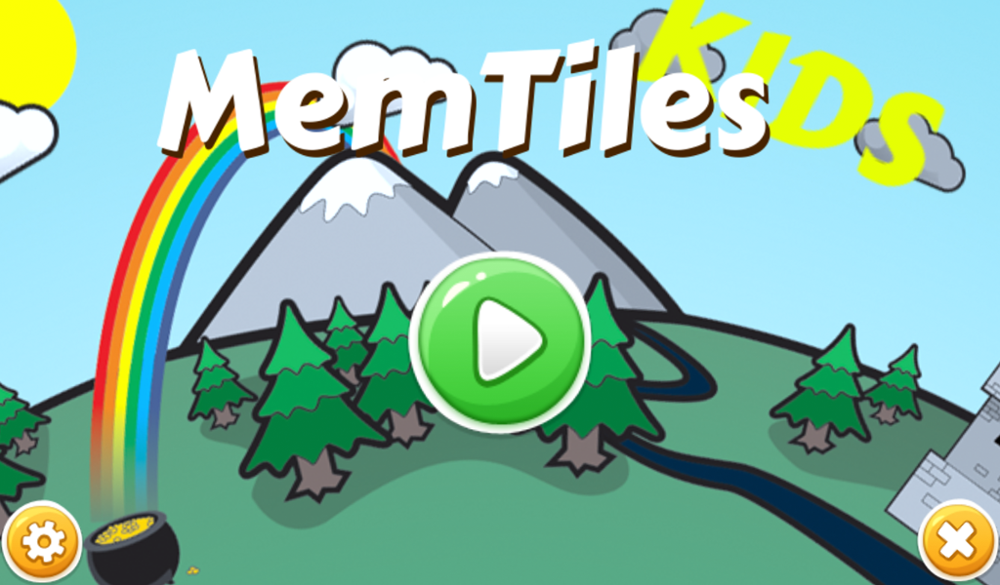
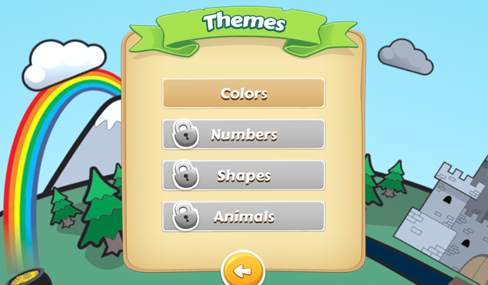
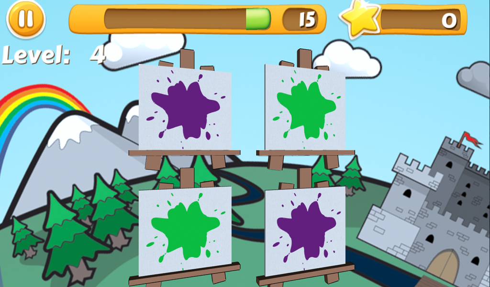

Memtile Kids is a simple memory games with four unique themes where you match Colors, Numbers, Shapes and Animals in a grid over 180 randomly generated puzzles.

It was released for Android but is now discontinued.
